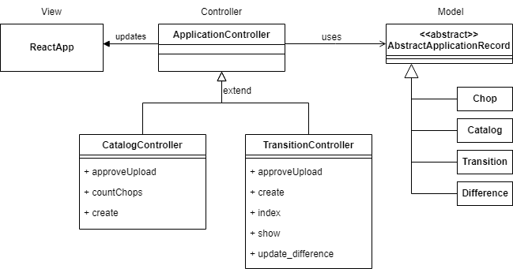

# Documentation

This project follows the standard Ruby on Rails Model-View-Controller (MVC) Pattern. Basic knowledge in this pattern is assumed.

Many boilerplate classes, which are generated by Rails, are left out in this UML-Class diagram. 

We have two subclasses of the ApplicationController, the base controller class.
The ```catalogController``` is responsible for everything concerning Catalogs and Chops.
* ```approveUpload``` validates if an incoming catalog is eligible to be inserted into the database
* ```countChops``` returns the amount of valid Chop-Codes in the database for a given year.
* ```create``` parses catalog ```.csv``` and creates all Chop-Code entries in the database. This method should only be called if ```approveUpload``` returned Status ```200```.


